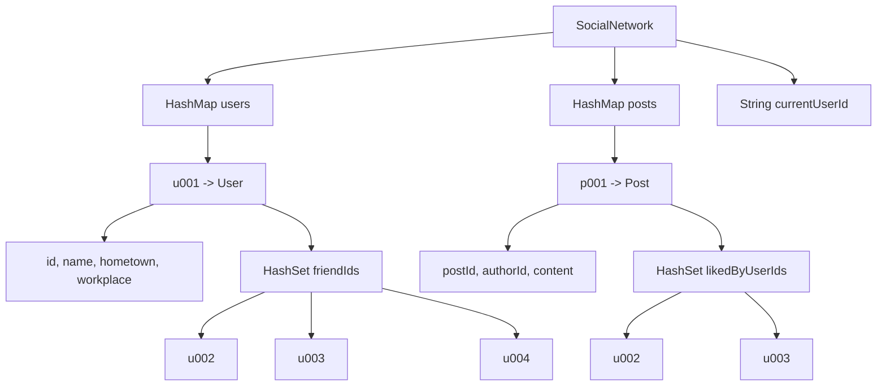
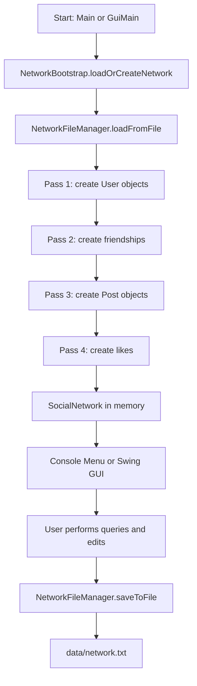
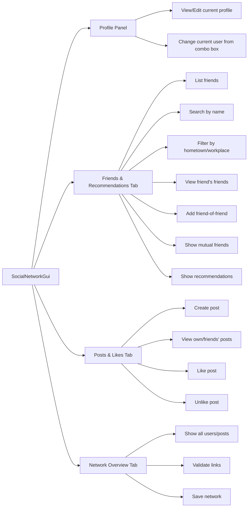

# 项目数据结构与流程图

## 1. 总体结构

本项目把社交网络设计成一张无向图：

- `User` 是图中的顶点。
- 好友关系是两个用户之间的无向边。
- `Post` 是附加在用户上的内容对象。
- 点赞关系是 `Post` 到用户 ID 的集合。
- `SocialNetwork` 是核心内存模型，保存所有用户、帖子和当前用户。
- `NetworkFileManager` 负责把内存模型和文本文件互相转换。
- `Menu` 是控制台界面。
- `SocialNetworkGui` 是 Swing 图形界面。

## 2. 整体数据结构图



## 3. 程序运行流程



## 4. 类图

```mermaid
classDiagram
    class User {
        -String id
        -String name
        -String hometown
        -String workplace
        -Set~String~ friendIds
        +addFriend(String friendId) boolean
        +removeFriend(String friendId) boolean
        +isFriendWith(String friendId) boolean
        +toFileString() String
    }

    class Post {
        -String postId
        -String authorId
        -String content
        -Set~String~ likedByUserIds
        +addLike(String userId) boolean
        +removeLike(String userId) boolean
        +isLikedBy(String userId) boolean
        +toFileString() String
    }

    class SocialNetwork {
        -Map~String, User~ users
        -Map~String, Post~ posts
        -String currentUserId
        +addFriendship(String id1, String id2) boolean
        +getFriendsOf(String userId) List~User~
        +getMutualFriends(String userId1, String userId2) List~User~
        +searchCurrentUserFriendsByName(String keyword) List~User~
        +recommendFriendsForCurrentUser() List~User~
        +createPostForCurrentUser(String content) Post
        +likePostAsCurrentUser(String postId) boolean
    }

    class NetworkFileManager {
        +loadFromFile(String filePath) SocialNetwork
        +saveToFile(SocialNetwork network, String filePath) void
    }

    class SocialNetworkGui {
        -SocialNetwork network
        -JComboBox~User~ currentUserBox
        -JList~User~ friendsList
        -JList~Post~ postsList
        +refreshAll() void
    }

    class Menu {
        -SocialNetwork network
        +start() void
    }

    class NetworkBootstrap {
        +loadOrCreateNetwork(String filePath) SocialNetwork
        +selectDefaultCurrentUser(SocialNetwork network) void
        +createSampleNetwork() SocialNetwork
    }

    SocialNetwork "1" o-- "*" User
    SocialNetwork "1" o-- "*" Post
    Post --> User : authorId
    SocialNetworkGui --> SocialNetwork
    Menu --> SocialNetwork
    NetworkBootstrap --> NetworkFileManager
```



## 5. 每个类的职责

| 类名 | 作用 | 主要数据结构 |
| --- | --- | --- |
| `User` | 保存用户资料和好友 ID | `HashSet<String>` |
| `Post` | 保存帖子内容、作者 ID、点赞用户 ID | `HashSet<String>` |
| `SocialNetwork` | 管理整张社交网络图、帖子、点赞和所有查询 | `HashMap<String, User>`、`HashMap<String, Post>` |
| `NetworkFileManager` | 读取和保存文本文件 | `List<String>` |
| `NetworkBootstrap` | 控制台和 GUI 共用的启动逻辑、示例数据 | 调用核心类 |
| `Menu` | 控制台菜单 | `Scanner`、`List<User>`、`List<Post>` |
| `GuiMain` | GUI 程序入口 | `SwingUtilities` |
| `SocialNetworkGui` | Swing 图形界面 | `JFrame`、`JTabbedPane`、`JList`、`DefaultListModel` |
| `Main` | 控制台程序入口 | 调用 `Menu` |

## 6. GUI 功能流程



## 7. 为什么这些数据结构合适

| 数据结构 | 使用位置 | 原因 |
| --- | --- | --- |
| `HashMap<String, User>` | `SocialNetwork.users` | 通过用户 ID 平均 `O(1)` 查找用户 |
| `HashMap<String, Post>` | `SocialNetwork.posts` | 通过帖子 ID 平均 `O(1)` 查找帖子 |
| `HashSet<String>` | `User.friendIds` | 避免重复好友，快速判断是否已是好友 |
| `HashSet<String>` | `Post.likedByUserIds` | 避免重复点赞，快速判断是否已点赞 |
| `ArrayList` / `List` | 查询结果、GUI 列表展示 | 方便排序、遍历和显示 |
| `DefaultListModel` | GUI 的 `JList` 数据源 | 适合动态刷新列表 |

## 8. 主要算法复杂度

| 功能 | 平均时间复杂度 | 说明 |
| --- | --- | --- |
| 按 ID 查找用户 | `O(1)` | `HashMap` |
| 按 ID 查找帖子 | `O(1)` | `HashMap` |
| 判断是否好友 | `O(1)` | `HashSet` |
| 添加好友关系 | `O(1)` | 两次 `HashSet.add` |
| 共同好友 | `O(f1 + f2)` | 对两个好友集合求交集 |
| 搜索好友姓名 | `O(f)` | 遍历当前用户好友 |
| 筛选家乡/工作地点 | `O(f)` | 遍历当前用户好友 |
| 好友推荐 | `O(f * k)` | 遍历好友的好友 |
| 点赞/取消点赞 | `O(1)` | `HashSet.add/remove` |
| 查看好友帖子 | `O(p)` | 遍历帖子并判断作者是否为好友 |

## 9. 文件格式

```text
USER|u001|Hongyi Guo|Changsha|University of Dundee
FRIENDS|u001|u002,u003,u004
POST|p001|u001|Working on our DI12010 social network project.
LIKES|p001|u002,u003
```

这四种记录共同保存完整社交网络：用户、好友边、帖子、点赞关系。
