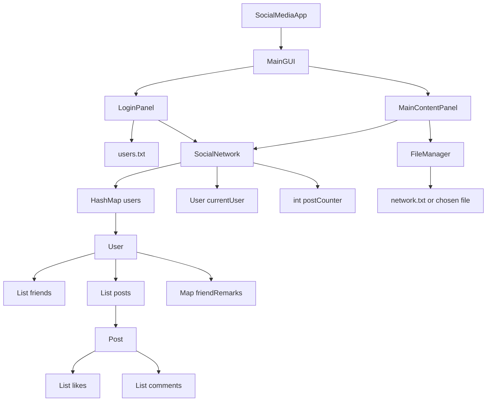
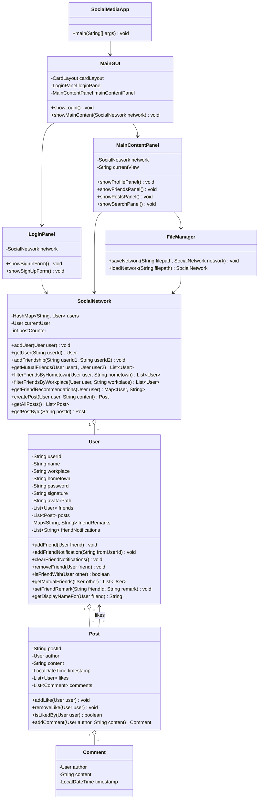
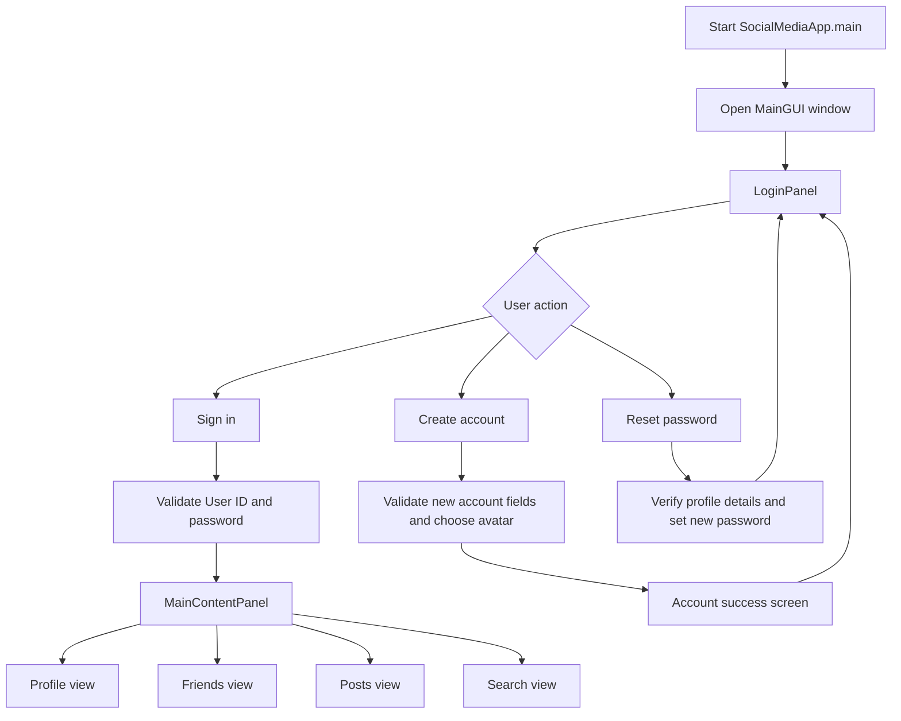

# SnapTok Data Structures and Flow

This document describes the current Java Swing version of SnapTok. The project models users as nodes in an undirected social graph, friendships as bidirectional edges, and posts as content owned by users.

## 1. Current Architecture



## 2. Main Classes



## 3. GUI Flow



## 4. Screen Responsibilities

| Screen | Main responsibility | Important data |
| --- | --- | --- |
| Sign in | Authenticate an existing user | `users.txt`, `SocialNetwork.users` |
| Sign up | Create a user, validate ID/password, choose avatar | `User`, `users.txt` |
| Reset password | Verify profile fields and update password | `User.password` |
| Profile | Edit current user's profile and show own posts | `currentUser`, `currentUser.posts` |
| Friends | Show friends, filters, details, remarks, add/remove friend, remind added users | `User.friends`, `friendRemarks`, `friendNotifications` |
| Posts | Create and view current user's and friends' posts | `Post`, `likes`, `comments` |
| Search | Recommend friends and fuzzy search by ID/name | `SocialNetwork.users`, graph queries |

## 5. Data Structures Used

| Data structure | Location | Purpose |
| --- | --- | --- |
| `HashMap<String, User>` | `SocialNetwork.users` | Fast lookup by user ID |
| `List<User>` | `User.friends` | Stores graph adjacency for each user |
| `List<Post>` | `User.posts` | Stores posts created by each user |
| `Map<String, String>` | `User.friendRemarks` | Stores remarks per owner and friend ID |
| `List<User>` | `Post.likes` | Stores users who liked a post and prevents duplicate likes |
| `List<Comment>` | `Post.comments` | Stores real comments under a post |
| `CardLayout` | `MainGUI`, forms inside panels | Switches between app screens |
| `JList` and `DefaultListModel` | Friends, posts, search results | Displays dynamic lists in the GUI |

## 6. Friend Remarks

Friend remarks are stored per user:

```text
currentUser.friendRemarks[friendId] = remark
```

This means Alice can set Bob's remark to `Project Partner`, while another user can still see Bob's normal name or set a different remark. Removing a friendship also removes the remark from both sides.

## 7. Post Visibility

The Moments page currently shows:

1. Posts created by the current user.
2. Posts created by the current user's friends.

Posts from unrelated users are hidden from this page. The Profile page separately shows only the current user's own posts.

## 8. File Formats

### Local account file

`users.txt` stores account and profile information for login:

```text
userId,password,name,workplace,hometown,signature,avatarPath,friendId:encodedRemark;...,encodedFriendNotification;...
```

### Full network file

The full network save/load feature uses sections:

```text
[USERS]
userId|name|workplace|hometown|password|signature|avatarPath|friendId:encodedRemark;...|encodedFriendNotification;...

[FRIENDSHIPS]
userId1|userId2

[POSTS]
postId|authorId|content|timestamp|likerId1,likerId2,...

[COMMENTS]
postId|authorId|content|timestamp

[COUNTER]
postCounter

[END]
```

Loading happens in this order:

1. Create all users.
2. Create bidirectional friendships.
3. Create posts and attach them to authors.
4. Attach comments to existing posts.
5. Restore the post counter.

## 9. Algorithm Complexity

Let `u` be the number of users, `f` be the number of friends of the current user, `p` be the number of visible posts, `l` be the number of likes on a post, and `c` be the number of comments on a post.

| Feature | Average time complexity | Notes |
| --- | --- | --- |
| Find user by ID | `O(1)` | Uses `HashMap` |
| Add user | `O(1)` | Adds to `HashMap` |
| Check if two users are friends | `O(f)` | Uses `List.contains` |
| Add friendship | `O(f1 + f2)` | Checks duplicate friends on both lists |
| Remove friendship | `O(f1 + f2)` | Removes from both lists |
| Mutual friends | `O(f1 * f2)` | Current implementation uses list containment |
| Filter friends by hometown/workplace | `O(f)` | Scans current user's friends |
| Fuzzy user search | `O(u)` | Scans all users by ID and name |
| Friend recommendations | `O(f * avgFriendCount)` | Scans friends-of-friends |
| Create post | `O(1)` | Appends to the author's post list |
| Collect visible Moments posts | `O(p log p)` | Collects then sorts newest first |
| Like or unlike a post | `O(l)` | Uses `List.contains` or `List.remove` |
| Add comment | `O(1)` | Appends to comments list |
| Render comments | `O(c)` | Displays all comments for a post |

## 10. Manual Verification Points

1. Register a user with a valid ID and password.
2. Select an avatar during registration.
3. Sign in with the new user.
4. Edit profile fields and signature.
5. Create a post.
6. Confirm the Moments page shows only own and friends' posts.
7. Like, unlike, and comment on a post.
8. Filter friends by all, same hometown, and same workplace.
9. Edit a friend remark and confirm it changes the list display.
10. Search users by ID or name.
11. Use recommendation tabs for mutual friends, same workplace, and same hometown.
12. Save and load a network file, then confirm users, friends, posts, likes, comments, and remarks are restored.
